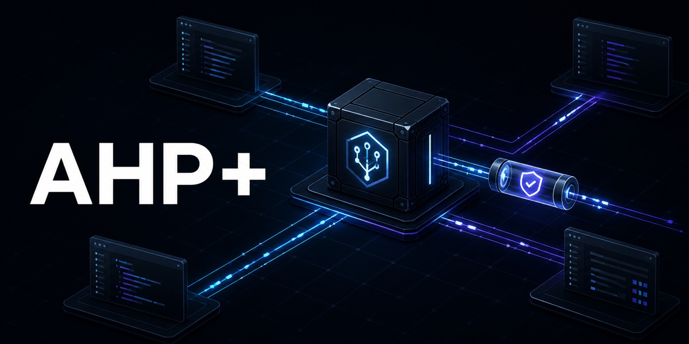
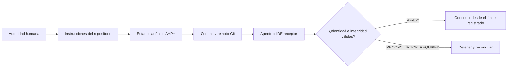

<div align="center">



# AHP+

**Continuidad verificable de proyectos entre agentes, IDEs, cuentas y máquinas.**

[](https://www.npmjs.com/package/@jossuealcala/ahp-plus)
[](https://github.com/jossuealcacao-exe/ahp_plus/actions/workflows/validate.yml)
[](package.json)
[](LICENSE)
[](https://github.com/jossuealcacao-exe/ahp_plus/releases/latest)

[English](README.md) · [Español](README.es.md) · [npm](https://www.npmjs.com/package/@jossuealcala/ahp-plus) · [Última versión](https://github.com/jossuealcacao-exe/ahp_plus/releases/latest) · [Portafolio](https://jossuealcala.com/es/)

</div>

---

> **Lanzamiento estable:** AHP+ `1.4.1` incorpora identidad por dispositivo,
> transporte cifrado, consulta en vivo acotada y salas de proyecto compartidas.
> Instálalo localmente en el proyecto desde npm con el comando versionado de
> abajo.

AHP+ (**Agent Handoff Protocol Plus**) es un protocolo abierto respaldado por
Git y una CLI de referencia para conservar la verdad operativa de un proyecto:
estado, decisiones, evidencia, checkpoints, límites de autoridad y handoffs
verificados.

El modelo, chat, IDE, cuenta y máquina pueden cambiar. El repositorio permanece
como fuente de verdad.

## Por qué existe AHP+

Las herramientas de IA pueden continuar una conversación, pero una conversación
no es un registro durable del proyecto. AHP+ responde las preguntas que importan
cuando el trabajo cambia de entorno:

- ¿Qué repositorio, rama, commit y árbol de trabajo están activos?
- ¿Qué decisiones siguen vigentes y quién las confirmó?
- ¿Qué pruebas o acciones externas fueron realmente observadas?
- ¿El estado es solo local, necesita push, está divergente o es portable?
- ¿El siguiente agente puede recibir el handoff sin cambiar el alcance?
- ¿Existe autoridad para la siguiente acción externa?

## Instalar en un proyecto

Requisitos: Git, Node.js 20 o superior y un repositorio Git con al menos un
commit. El runtime no tiene dependencias de terceros. No hace falta que el
proyecto ya tenga `package.json`: si falta, `setup` crea uno mínimo y privado
dentro del repositorio antes de fijar AHP+, para que npm nunca instale en un
directorio padre.

La instalación local y configuración de IDE de AHP+ 1.4 se hacen con un solo
comando:

```bash
npx @jossuealcala/ahp-plus@1.4.1 setup .
```

`setup` fija la versión exacta, inicializa o actualiza `.ahp/` con respaldo,
instala adaptadores y MCP para Codex/Claude, crea pares de claves separados
fuera de Git y ejecuta doctor más verificación estricta. Es idempotente. Antes
de la publicación, prueba el tarball local exacto o usa `node bin/ahp.mjs setup .
--no-install` desde este checkout.

Si el proyecto usa un solo IDE, limita la integración generada:

```bash
npx @jossuealcala/ahp-plus@1.4.1 setup . --platforms codex
```

Ejecuta el primer pulso:

```bash
npx ahp project check .
npx ahp project status .
npx ahp session context . --format markdown --budget 8000
```

Usa `npx ahp help`, `npx ahp help message` o
`npx ahp catalog --format json` para descubrir el contrato. Los comandos 1.2,
como `ahp verify --strict`, continúan funcionando como aliases.

Revisa los archivos generados antes de confirmarlos. AHP+ nunca ejecuta commit,
push, merge, deploy, publicación o eliminación, ni se concede autoridad.

Para una instalación reproducible exacta usa
`@jossuealcala/ahp-plus@1.4.1`. No uses `main` como dependencia de producción.

## Cómo funciona



Cada instancia AHP+ pertenece a un solo repositorio Git. Un workspace padre
nunca debe prestar su rama o commit a un repositorio anidado.

## Qué registra AHP+

| Registro | Propósito |
|---|---|
| Estado del proyecto | Fase, objetivo, siguiente acción, bloqueos y frontera Git aceptada |
| Evidencia | Comandos, artefactos, URLs, checksums y resultados observados |
| Decisiones | Elecciones durables, autoridad, fuentes y supersesión explícita |
| QA | Gates PASS/FAIL respaldados por IDs de evidencia |
| Checkpoints | Límites de sesión recuperables |
| Handoffs | Continuidad sellada entre plataformas con verificación del receptor |
| Eventos de continuidad | Mensajes operativos append-only enlazados por fingerprints SHA-256 |
| Sobres y recibos de relay | Intentos de entrega autenticados y acuses creados por el receptor con fingerprints separados |
| Identidades y sobres seguros | Firmas Ed25519, acuerdo X25519, payload AES-256-GCM y recibos firmados |
| Riesgos y locks | Riesgos visibles y avisos cooperativos de concurrencia |

Las afirmaciones usan niveles explícitos: `VERIFIED`, `USER_CONFIRMED`,
`INFERRED`, `UNVERIFIED`, `STALE` y `CONFLICTED`.

## Uso en terminal e IDE

AHP+ tiene un solo contrato de comandos. Los adaptadores lo traducen a cada
host sin cambiar la semántica del protocolo.

| Superficie | Interfaz instalada | Ejemplo |
|---|---|---|
| Terminal | `npx ahp` | `npx ahp project check .` |
| Cursor | Comando `/ahp` | `/ahp message inbox for=cursor` |
| OpenCode | Comando `/ahp` | `/ahp message send to=claude text="Continúa"` |
| Codex | Skill local `$ahp` | `Usa $ahp para revisar el proyecto y leer mi inbox` |
| Claude Code | Instrucciones del repositorio | `Usa AHP+ para ejecutar doctor y verify strict` |
| ChatGPT / móvil | Cápsula de lectura o CLI disponible | `Lee AHP_MOBILE.md e inspecciona HOF-...` |
| Agentes genéricos | `AGENTS.md` + `AHP_INSTRUCTIONS.md` | `Sigue las instrucciones AHP+ del repositorio` |

Primero revisa el plan de adaptadores y después aplícalo deliberadamente:

```bash
npx ahp adapter install all .
npx ahp adapter install all . --apply
```

Consulta [comandos por superficie](docs/COMMANDS_BY_SURFACE_ES.md) para ver los
ejemplos completos de terminal, IDE y app.

## Una opinión acotada de otra IA

El adaptador MCP de 1.4 expone una consulta de solo lectura dentro del mismo
chat del IDE. Puedes pedir “Usa AHP+ para preguntarle a Claude qué riesgo ve en
esta implementación” o ejecutar:

```bash
ahp agent ask claude "Revisa la implementación actual e identifica el riesgo principal"
```

AHP+ abre el CLI destino en modo de solo lectura, comparte contexto acotado,
acepta exactamente una respuesta y registra eventos `CONSULT_REQUEST` y
`CONSULT_RESPONSE` enlazados por fingerprints. No crea un loop autónomo ni
autoriza ediciones, Git remoto, deploy o publicación.

## Flujo de handoff

Crea un límite recuperable y transfiérelo a otro host:

```bash
npx ahp checkpoint . \
  --session feature-auth \
  --platform codex \
  --actor "Codex" \
  --summary "Límite de autenticación validado" \
  --next-action "Continuar con la prueba de refresh token"

npx ahp handoff create . \
  --from codex \
  --to cursor \
  --session feature-auth \
  --summary "Continuar desde el límite validado"
```

En el entorno receptor:

```bash
npx ahp verify . --strict
npx ahp ready . --platform cursor
npx ahp handoff inspect HOF-... .
npx ahp handoff receive HOF-... .
npx ahp sync check . --require-remote
```

`READY` prueba compatibilidad con el límite registrado. No autoriza commit,
push, merge, deploy, publicación, pagos, eliminación ni acceso a secretos.

`ready` separa la capacidad de continuar localmente de la portabilidad remota.
Una copia local compartida puede estar lista aunque todavía muestre
`PUSH_REQUIRED`.

## Fingerprints de Continuity Events

AHP+ 1.2 puede registrar mensajes operativos seleccionados bajo `.ahp/events/`.
Cada evento se sella con SHA-256 y referencia el ID y fingerprint de su padre
causal:

```bash
npx --no-install ahp message send "Continuar desde la frontera verificada" \
  --session cross-agent \
  --from claude \
  --to codex

npx --no-install ahp message inbox . --for codex --session cross-agent
npx --no-install ahp message reply EVT-... "Recibido y verificado" --from codex
npx --no-install ahp message verify EVT-... .
```

La cadena detecta mutaciones y relaciones causales rotas. No autentica a una IA
ni por sí sola entrega mensajes en tiempo real. AHP+ 1.3 añade sobres de relay
autenticados y recibos creados por el receptor con un canal de archivos
persistente de referencia:

```bash
export AHP_RELAY_SECRET='reemplaza-con-un-secreto-aleatorio-de-32-bytes-o-mas'
ahp relay send EVT-... --channel /shared/ahp-relay
ahp relay wait --as codex --channel /shared/ahp-relay
ahp relay confirm --as claude --channel /shared/ahp-relay
ahp relay receipt verify RCP-...
```

El fingerprint EVT original sobrevive al transporte; RLY y RCP tienen
fingerprints propios. Los replays son idempotentes y se rechazan antes de
importar los payloads modificados, secretos incorrectos, sobres expirados,
rutas equivocadas y padres causales faltantes. El HMAC de referencia prueba la
posesión de un secreto compartido del proyecto, no la identidad única del
modelo o dispositivo. El canal de archivos es un carrier de prueba/referencia
reconectable, no un relay cifrado de Internet. Un proveedor de producción sobre
A2A, MCP o WebSocket debe añadir confidencialidad de transporte y control de
acceso. Consulta [Continuity Events](docs/CONTINUITY_EVENTS.md).

Los procesos del chat de un IDE pueden no heredar las variables exportadas en
su terminal integrada. Los adaptadores de producción deben usar inyección de
secretos del host o un archivo externo restringido mediante `--secret-file`,
nunca un secreto pegado en la conversación.

Los proyectos AHP+ 1.1 siguen siendo legibles. Ejecuta
`ahp upgrade . --plan` y revisa el resultado antes de `--apply`; los records,
checkpoints y handoffs 1.1 conservan su schema y fingerprint originales.

## Entrega cifrada entre dispositivos

AHP+ 1.4 puede usar identidad por dispositivo y cifrado de payload:

```bash
ahp identity list
ahp secure network send EVT-... \
  --from-device DEV-EMISOR --to-device DEV-RECEPTOR \
  --url https://relay.example --token-file /protegido/ahp.token
ahp secure network receive --as-device DEV-RECEPTOR \
  --url https://relay.example --token-file /protegido/ahp.token
ahp secure network confirm --as-device DEV-EMISOR \
  --url https://relay.example --token-file /protegido/ahp.token
```

`ahp hub serve` incluye un carrier de objetos cifrados. Solo permite HTTP en
loopback; una interfaz remota exige certificado y llave TLS. El carrier observa
metadatos de ruta y ciphertext, no el contenido del evento. Consulta
[interoperabilidad en vivo](docs/LIVE_INTEROP_ES.md).

## Estados de portabilidad

| Estado | Significado operativo |
|---|---|
| `LOCAL_ONLY` | Los cambios del proyecto no están transportados por Git |
| `PUSH_REQUIRED` | El estado AHP+ necesita commit y push autorizados |
| `REMOTE_DIVERGED` | El historial local y remoto requiere reconciliación |
| `REMOTE_READY` | La copia limpia coincide con su upstream configurado |

## Dónde encaja AHP+

AHP+ complementa la infraestructura de agentes existente:

- **AGENTS.md** define cómo deben trabajar los agentes en un repositorio.
- **MCP** conecta aplicaciones de IA con herramientas, datos y prompts.
- **A2A** permite comunicación en vivo entre agentes independientes.
- **ACP** conecta agentes con editores y clientes interactivos.
- **Git** transporta y audita contenido confirmado.
- **AHP+** conserva estado, evidencia, autoridad, portabilidad y handoffs
  verificados entre todas estas capas.

Lee [Qué diferencia a AHP+](docs/WHY_AHP_ES.md) para conocer el límite completo.

## Validación de liberación

El lanzamiento estable AHP+ 1.4 superó pruebas del núcleo, conformidad del protocolo,
verificación estricta, inspección del paquete y onboarding desde tarball local
en proyectos Git con y sin Node. También se completó la aceptación de la sala
compartida Codex–Claude en chats independientes de IDE. Una instalación nueva
desde el registro público de npm sigue siendo una confirmación obligatoria
inmediatamente después de la publicación autorizada.

## Documentación

| Guía | Propósito |
|---|---|
| [Primeros pasos](docs/GETTING_STARTED_ES.md) | Instalación y primeros 15 minutos |
| [Operación cotidiana](docs/OPERATIONS_ES.md) | Estado, evidencia, checkpoints, handoffs y actualización |
| [Comandos](docs/COMMANDS.md) | Contrato normativo de la CLI |
| [Comandos por superficie](docs/COMMANDS_BY_SURFACE_ES.md) | Invocación en terminal, IDE y app |
| [Arquitectura](docs/ARCHITECTURE.md) | Identidad del repositorio y layout del protocolo |
| [Continuity Events](docs/CONTINUITY_EVENTS.md) | Fingerprints causales, relay autenticado y recibos del receptor |
| [Conformidad](docs/CONFORMANCE.md) | Criterios de aceptación interplataforma |
| [Canales de distribución](docs/CHANNELS_ES.md) | Estable `latest` y desarrollo `next` |
| [Feedback público](docs/COMMUNITY_FEEDBACK_ES.md) | Reportes seguros y reproducibles |
| [Interoperabilidad en vivo](docs/LIVE_INTEROP_ES.md) | Setup de un comando, consulta entre IA, identidad y carrier cifrado |
| [Especificación](SPECIFICATION.md) | Protocolo AHP+ 1.4 |

## Canales de distribución

- **Estable:** versiones semánticas en npm `latest` y GitHub Releases normales.
- **Desarrollo:** versiones prerelease en npm `next` y GitHub
  prereleases.

## Seguridad y contribución

No publiques secretos, contenido de repositorios privados, datos de clientes ni
directorios `.ahp/` completos en issues públicos. Sigue [SECURITY.md](SECURITY.md)
para reportes de seguridad y [CONTRIBUTING.md](CONTRIBUTING.md) para cambios.

## Autor

Creado y mantenido por **Jossue Alcalá**.

- [Portafolio](https://jossuealcala.com/es/)
- [GitHub](https://github.com/jossuealcacao-exe)
- [LinkedIn](https://www.linkedin.com/in/jossue-alcala)

## Licencia

Apache-2.0. Consulta [LICENSE](LICENSE) y [NOTICE](NOTICE).
