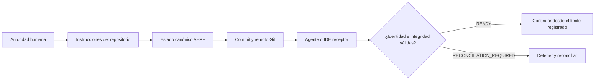

<div align="center">


# AHP+

**Continuidad verificable de proyectos entre agentes, IDEs, cuentas y máquinas.**

[](https://www.npmjs.com/package/@jossuealcala/ahp-plus)
[](https://github.com/jossuealcacao-exe/ahp_plus/actions/workflows/validate.yml)
[](package.json)
[](LICENSE)
[](https://github.com/jossuealcacao-exe/ahp_plus/releases/latest)

[English](README.md) · [Español](README.es.md) · [npm](https://www.npmjs.com/package/@jossuealcala/ahp-plus) · [Última versión](https://github.com/jossuealcacao-exe/ahp_plus/releases/latest) · [Portafolio](https://jossuealcala.com/es/)

</div>

---

AHP+ (**Agent Handoff Protocol Plus**) es un protocolo abierto respaldado por
Git y una CLI de referencia para conservar la verdad operativa de un proyecto:
estado, decisiones, evidencia, checkpoints, límites de autoridad y handoffs
verificados.

El modelo, chat, IDE, cuenta y máquina pueden cambiar. El repositorio permanece
como fuente de verdad.

## Por qué existe AHP+

Las herramientas de IA pueden continuar una conversación, pero una conversación
no es un registro durable del proyecto. AHP+ responde las preguntas que importan
cuando el trabajo cambia de entorno:

- ¿Qué repositorio, rama, commit y árbol de trabajo están activos?
- ¿Qué decisiones siguen vigentes y quién las confirmó?
- ¿Qué pruebas o acciones externas fueron realmente observadas?
- ¿El estado es solo local, necesita push, está divergente o es portable?
- ¿El siguiente agente puede recibir el handoff sin cambiar el alcance?
- ¿Existe autoridad para la siguiente acción externa?

## Instalar en un proyecto

Requisitos: Git, Node.js 20 o superior y un repositorio Git con al menos un
commit. El runtime no tiene dependencias de terceros.

```bash
npm install --save-dev @jossuealcala/ahp-plus@latest
npx ahp init . --owner "Tu nombre" --project tu-proyecto
```

Ejecuta el primer pulso:

```bash
npx ahp root .
npx ahp doctor .
npx ahp verify . --strict
npx ahp status .
npx ahp context . --format markdown --budget 8000
```

Revisa los archivos generados antes de confirmarlos. AHP+ nunca ejecuta commit,
push, merge, deploy, publicación o eliminación, ni se concede autoridad.

Para una instalación reproducible exacta usa
`@jossuealcala/ahp-plus@1.1.0`. No uses `main` como dependencia de producción.

## Cómo funciona



Cada instancia AHP+ pertenece a un solo repositorio Git. Un workspace padre
nunca debe prestar su rama o commit a un repositorio anidado.

## Qué registra AHP+

| Registro | Propósito |
|---|---|
| Estado del proyecto | Fase, objetivo, siguiente acción, bloqueos y frontera Git aceptada |
| Evidencia | Comandos, artefactos, URLs, checksums y resultados observados |
| Decisiones | Elecciones durables, autoridad, fuentes y supersesión explícita |
| QA | Gates PASS/FAIL respaldados por IDs de evidencia |
| Checkpoints | Límites de sesión recuperables |
| Handoffs | Continuidad sellada entre plataformas con verificación del receptor |
| Riesgos y locks | Riesgos visibles y avisos cooperativos de concurrencia |

Las afirmaciones usan niveles explícitos: `VERIFIED`, `USER_CONFIRMED`,
`INFERRED`, `UNVERIFIED`, `STALE` y `CONFLICTED`.

## Uso en terminal e IDE

AHP+ tiene un solo contrato de comandos. Los adaptadores lo traducen a cada
host sin cambiar la semántica del protocolo.

| Superficie | Interfaz instalada | Ejemplo |
|---|---|---|
| Terminal | `npx ahp` | `npx ahp verify . --strict` |
| Cursor | Comando `/ahp` | `/ahp verify strict` |
| OpenCode | Comando `/ahp` | `/ahp handoff to claude` |
| Codex | Skill local `$ahp` | `Usa $ahp para verificar este repositorio` |
| Claude Code | Instrucciones del repositorio | `Usa AHP+ para ejecutar doctor y verify strict` |
| ChatGPT / móvil | Cápsula de lectura o CLI disponible | `Lee AHP_MOBILE.md e inspecciona HOF-...` |
| Agentes genéricos | `AGENTS.md` + `AHP_INSTRUCTIONS.md` | `Sigue las instrucciones AHP+ del repositorio` |

Primero revisa el plan de adaptadores y después aplícalo deliberadamente:

```bash
npx ahp adapter install all .
npx ahp adapter install all . --apply
```

Consulta [comandos por superficie](docs/COMMANDS_BY_SURFACE_ES.md) para ver los
ejemplos completos de terminal, IDE y app.

## Flujo de handoff

Crea un límite recuperable y transfiérelo a otro host:

```bash
npx ahp checkpoint . \
  --session feature-auth \
  --platform codex \
  --actor "Codex" \
  --summary "Límite de autenticación validado" \
  --next-action "Continuar con la prueba de refresh token"

npx ahp handoff create . \
  --from codex \
  --to cursor \
  --session feature-auth \
  --summary "Continuar desde el límite validado"
```

En el entorno receptor:

```bash
npx ahp verify . --strict
npx ahp handoff inspect HOF-... .
npx ahp handoff receive HOF-... .
npx ahp sync check . --require-remote
```

`READY` prueba compatibilidad con el límite registrado. No autoriza commit,
push, merge, deploy, publicación, pagos, eliminación ni acceso a secretos.

## Estados de portabilidad

| Estado | Significado operativo |
|---|---|
| `LOCAL_ONLY` | Los cambios del proyecto no están transportados por Git |
| `PUSH_REQUIRED` | El estado AHP+ necesita commit y push autorizados |
| `REMOTE_DIVERGED` | El historial local y remoto requiere reconciliación |
| `REMOTE_READY` | La copia limpia coincide con su upstream configurado |

## Dónde encaja AHP+

AHP+ complementa la infraestructura de agentes existente:

- **AGENTS.md** define cómo deben trabajar los agentes en un repositorio.
- **MCP** conecta aplicaciones de IA con herramientas, datos y prompts.
- **A2A** permite comunicación en vivo entre agentes independientes.
- **ACP** conecta agentes con editores y clientes interactivos.
- **Git** transporta y audita contenido confirmado.
- **AHP+** conserva estado, evidencia, autoridad, portabilidad y handoffs
  verificados entre todas estas capas.

Lee [Qué diferencia a AHP+](docs/WHY_AHP_ES.md) para conocer el límite completo.

## Calidad verificada de la versión

AHP+ 1.1.0 se prueba en Ubuntu, macOS y Windows con Node.js 20 y 22. La versión
estable superó:

- pruebas del núcleo y conformidad del protocolo;
- verificación estricta de integridad y ascendencia;
- shallow clones y rutas Git nativas de Windows;
- contenido y checksum del paquete;
- instalación limpia desde npm `latest`;
- instalación de adaptadores en todas las superficies soportadas;
- un handoff real Codex → Cursor en `iris-foundation`.

Los artefactos de npm y GitHub comparten el SHA-256
`c953fe7eb0c67070bf91d6342d1d1efe5fc036045eb5b3edf6897efa5cfc0548`.

## Documentación

| Guía | Propósito |
|---|---|
| [Primeros pasos](docs/GETTING_STARTED_ES.md) | Instalación y primeros 15 minutos |
| [Operación cotidiana](docs/OPERATIONS_ES.md) | Estado, evidencia, checkpoints, handoffs y actualización |
| [Comandos](docs/COMMANDS.md) | Contrato normativo de la CLI |
| [Comandos por superficie](docs/COMMANDS_BY_SURFACE_ES.md) | Invocación en terminal, IDE y app |
| [Arquitectura](docs/ARCHITECTURE.md) | Identidad del repositorio y layout del protocolo |
| [Conformidad](docs/CONFORMANCE.md) | Criterios de aceptación interplataforma |
| [Canales de distribución](docs/CHANNELS_ES.md) | Estable `latest` y desarrollo `next` |
| [Feedback público](docs/COMMUNITY_FEEDBACK_ES.md) | Reportes seguros y reproducibles |
| [Especificación](SPECIFICATION.md) | Protocolo normativo AHP+ 1.1 |

## Canales de distribución

- **Estable:** versiones semánticas en npm `latest` y GitHub Releases normales.
- **Desarrollo:** versiones como `1.1.1-dev.0` en npm `next` y GitHub
  prereleases.

## Seguridad y contribución

No publiques secretos, contenido de repositorios privados, datos de clientes ni
directorios `.ahp/` completos en issues públicos. Sigue [SECURITY.md](SECURITY.md)
para reportes de seguridad y [CONTRIBUTING.md](CONTRIBUTING.md) para cambios.

## Autor

Creado y mantenido por **Jossue Alcalá**.

- [Portafolio](https://jossuealcala.com/es/)
- [GitHub](https://github.com/jossuealcacao-exe)
- [LinkedIn](https://www.linkedin.com/in/jossue-alcala)

## Licencia

Apache-2.0. Consulta [LICENSE](LICENSE) y [NOTICE](NOTICE).
