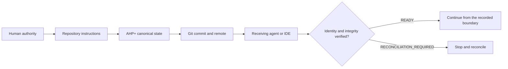

<div align="center">


# AHP+

**Verifiable project continuity across AI agents, IDEs, accounts, and machines.**

[](https://www.npmjs.com/package/@jossuealcala/ahp-plus)
[](https://github.com/jossuealcacao-exe/ahp_plus/actions/workflows/validate.yml)
[](package.json)
[](LICENSE)
[](https://github.com/jossuealcacao-exe/ahp_plus/releases/latest)

[English](README.md) · [Español](README.es.md) · [npm](https://www.npmjs.com/package/@jossuealcala/ahp-plus) · [Latest release](https://github.com/jossuealcacao-exe/ahp_plus/releases/latest) · [Portfolio](https://jossuealcala.com/en/)

</div>

---

> **Release candidate:** this source tree is prepared as AHP+ `1.4.0`, with
> device identity, encrypted transport, bounded live consultation, and shared
> project rooms. npm `next` remains `1.2.0-dev.0` and `latest` remains `1.1.0`
> until publication is separately authorized and verified.

AHP+ (**Agent Handoff Protocol Plus**) is an open, Git-backed protocol and a
reference CLI for preserving the operational truth of a software project:
state, decisions, evidence, checkpoints, authority boundaries, and verified
handoffs.

The model, chat, IDE, account, and machine may change. The repository remains
the source of truth.

## Why AHP+

AI tools are good at continuing a conversation, but a conversation is not a
durable project record. AHP+ answers the questions that matter when work moves
between environments:

- Which repository, branch, commit, and working tree are active?
- Which decisions are still valid, and who confirmed them?
- Which tests or external actions were actually observed?
- Is the current state local-only, waiting for a push, diverged, or portable?
- Can the next agent receive the handoff without silently changing scope?
- Does the agent have authority for the next external action?

## Install in a project

Requirements: Git, Node.js 20 or newer, and a Git repository with at least one
commit. The runtime has no third-party dependencies. A `package.json` is not
required: when one is absent, `setup` creates a minimal private manifest inside
the project before pinning AHP+, so npm never installs into a parent directory.

After 1.4 is published, installation and IDE setup are a single project-local
command:

```bash
npx @jossuealcala/ahp-plus@1.4.0 setup .
```

`setup` pins the exact package, initializes or safely upgrades `.ahp/`, installs
the Codex and Claude adapters plus MCP configuration, creates separate device
key pairs outside Git, and runs doctor plus strict verification. It is
idempotent. Until the release is published, test the exact local package
tarball or use `node bin/ahp.mjs setup . --no-install` from this checkout.

If the project uses only one IDE, limit the generated integration:

```bash
npx @jossuealcala/ahp-plus@1.4.0 setup . --platforms codex
```

Run the first heartbeat:

```bash
npx ahp project check .
npx ahp project status .
npx ahp session context . --format markdown --budget 8000
```

Run `npx ahp help`, `npx ahp help message`, or
`npx ahp catalog --format json` to discover the command contract. Existing
1.2 commands such as `ahp verify --strict` remain supported as aliases.

Review the generated files before committing them. AHP+ never commits, pushes,
merges, deploys, publishes, deletes, or grants itself authority.

For an exact reproducible pin, install
`@jossuealcala/ahp-plus@1.4.0`. Do not use `main` as a production dependency.

## How it works



One AHP+ instance belongs to one Git repository. A parent workspace must never
lend its branch or commit identity to a nested repository.

## What AHP+ records

| Record | Purpose |
|---|---|
| Project state | Phase, objective, next action, blockers, and accepted Git boundary |
| Evidence | Reproducible commands, artifacts, URLs, checksums, and observed results |
| Decisions | Durable choices, authority, sources, and explicit supersession |
| QA | Pass/fail gates backed by evidence IDs |
| Checkpoints | Recoverable session boundaries |
| Handoffs | Sealed continuity between platforms with receiver verification |
| Continuity events | Append-only operational messages linked by causal SHA-256 fingerprints |
| Relay envelopes and receipts | Authenticated delivery attempts and receiver-created acknowledgements with separate fingerprints |
| Device identities and secure envelopes | Ed25519 signatures, X25519 key agreement, AES-256-GCM payloads, and signed delivery receipts |
| Risks and locks | Visible risk tracking and cooperative concurrency notices |

Claims use explicit certainty levels: `VERIFIED`, `USER_CONFIRMED`, `INFERRED`,
`UNVERIFIED`, `STALE`, and `CONFLICTED`.

## Terminal and IDE usage

AHP+ has one command contract. Adapters translate that contract into the
conventions of each host without changing protocol semantics.

| Surface | Installed interface | Example |
|---|---|---|
| Terminal | `npx ahp` | `npx ahp project check .` |
| Cursor | `/ahp` command | `/ahp message inbox for=cursor` |
| OpenCode | `/ahp` command | `/ahp message send to=claude text="Continue"` |
| Codex | Local `$ahp` skill | `Use $ahp to check the project and read my inbox` |
| Claude Code | Repository instructions | `Use AHP+ to run doctor and strict verification` |
| ChatGPT / mobile | Read-only capsule or CLI when available | `Read AHP_MOBILE.md and inspect HOF-...` |
| Generic agents | `AGENTS.md` + `AHP_INSTRUCTIONS.md` | `Follow this repository's AHP+ instructions` |

Preview adapter changes first, then apply them deliberately:

```bash
npx ahp adapter install all .
npx ahp adapter install all . --apply
```

See [commands by surface](docs/COMMANDS_BY_SURFACE_ES.md) for complete terminal,
IDE, and app examples.

## One bounded opinion from another AI

The 1.4 MCP adapter exposes a read-only consultation tool inside the same IDE
chat. A user can say, “Use AHP+ to ask Claude to review this implementation,”
or run:

```bash
ahp agent ask claude "Review the current implementation and identify the highest-risk gap"
```

AHP+ starts the target CLI in read-only mode, sends bounded repository context,
accepts exactly one response, and records `CONSULT_REQUEST` and
`CONSULT_RESPONSE` events with causal fingerprints. It is not an autonomous
agent loop and grants no edit, Git-network, deployment, or publication authority.

## Shared project conversation rooms

AHP+ 1.4 also provides a durable shared room for a project conversation across
IDE chats. Each participant uses the same MCP server from its own chat surface:

```bash
ahp conversation open "Architecture review" --participants codex,claude --from codex
ahp conversation send conv-... "Please review the migration risk." --from codex
ahp conversation inbox conv-... --for claude
ahp conversation wait conv-... --for claude --timeout 60
```

Every room and message is a sealed causal event. `wait` is an explicit,
user-visible long poll and may surface messages already imported by an approved
relay. It does **not** inject text into another IDE's native chat, wake an idle
agent, or prove cross-device delivery. Use the secure relay and its signed
receipt when the participants are on separate devices.

## Handoff workflow

Create a recoverable boundary and transfer it to another host:

```bash
npx ahp checkpoint . \
  --session feature-auth \
  --platform codex \
  --actor "Codex" \
  --summary "Validated the authentication boundary" \
  --next-action "Continue with the refresh-token test"

npx ahp handoff create . \
  --from codex \
  --to cursor \
  --session feature-auth \
  --summary "Continue from the validated boundary"
```

At the receiving environment:

```bash
npx ahp verify . --strict
npx ahp ready . --platform cursor
npx ahp handoff inspect HOF-... .
npx ahp handoff receive HOF-... .
npx ahp sync check . --require-remote
```

`READY` proves compatibility with the recorded boundary. It does not authorize
a commit, push, merge, deployment, publication, payment, deletion, or access to
secrets.

`ready` reports local continuation and remote transport separately. A shared
local checkout can be ready while portability remains `PUSH_REQUIRED`.

## Continuity Event fingerprints

AHP+ 1.2 can append selected operational messages to `.ahp/events/`. Each event
is sealed with SHA-256 and points to its causal parent's ID and fingerprint:

```bash
npx --no-install ahp message send "Continue from the verified reconciliation boundary" \
  --session cross-agent \
  --from claude \
  --to codex

npx --no-install ahp message inbox . --for codex --session cross-agent
npx --no-install ahp message reply EVT-... "Received and verified" --from codex
npx --no-install ahp message verify EVT-... .
```

This detects mutation and broken causal chains. It does not authenticate an AI
or by itself provide realtime delivery. AHP+ 1.3 adds authenticated relay
envelopes and receiver-created receipts with a reference persistent file
channel:

```bash
export AHP_RELAY_SECRET='replace-with-a-random-project-secret-of-32-plus-bytes'
ahp relay send EVT-... --channel /shared/ahp-relay
ahp relay wait --as codex --channel /shared/ahp-relay
ahp relay confirm --as claude --channel /shared/ahp-relay
ahp relay receipt verify RCP-...
```

The original EVT fingerprint survives transport; RLY and RCP documents receive
their own fingerprints. Replays are idempotent and changed payloads, wrong
secrets, expired envelopes, wrong routes, and missing causal parents are
rejected before import. The reference HMAC proves possession of a shared
project secret, not unique model or device identity. The file channel is a
reconnectable test/reference carrier, not an encrypted Internet relay. A
production A2A/MCP/WebSocket provider must add transport confidentiality and
access control. See [Continuity Events](docs/CONTINUITY_EVENTS.md).

IDE chat processes may not inherit variables exported in their integrated
terminal. Production adapters should use host-level secret injection or a
permission-restricted external file through `--secret-file`, never a secret
pasted into chat.

Existing AHP+ 1.1 projects remain readable. Run `ahp upgrade . --plan` and
review it before `--apply`; sealed 1.1 records, checkpoints, and handoffs retain
their original schema and fingerprint.

## Encrypted cross-device delivery

AHP+ 1.4 replaces shared-secret identity assurance when requested with device
keys and encrypted payloads:

```bash
ahp identity list
ahp secure network send EVT-... \
  --from-device DEV-SENDER --to-device DEV-RECEIVER \
  --url https://relay.example --token-file /protected/ahp.token
ahp secure network receive --as-device DEV-RECEIVER \
  --url https://relay.example --token-file /protected/ahp.token
ahp secure network confirm --as-device DEV-SENDER \
  --url https://relay.example --token-file /protected/ahp.token
```

The bundled `ahp hub serve` is a reference encrypted-object carrier. It may use
plain HTTP only on loopback; non-loopback binding requires TLS certificate and
key files. The carrier sees routing metadata and ciphertext, not event content.
See [live interoperability](docs/LIVE_INTEROP_ES.md) for the full flow.

## Portability states

| Status | Operational meaning |
|---|---|
| `LOCAL_ONLY` | Project changes are not transported by Git |
| `PUSH_REQUIRED` | New AHP+ state still needs an authorized commit and push |
| `REMOTE_DIVERGED` | Local and remote history require reconciliation |
| `REMOTE_READY` | The clean checkout matches its configured upstream |

## Where AHP+ fits

AHP+ complements existing agent infrastructure:

- **AGENTS.md** defines how agents should work in a repository.
- **MCP** connects AI applications to tools, data, and prompts.
- **A2A** supports live communication between independent agents.
- **ACP** connects agents to editors and interactive clients.
- **Git** transports and audits confirmed content.
- **AHP+** preserves durable project state, evidence, authority, portability,
  and receiver-verified handoffs across all of them.

Read [What makes AHP+ different](docs/WHY_AHP_ES.md) for the detailed boundary.

## Release validation

The AHP+ 1.4.0 candidate passed core tests, protocol conformance, strict
verification, package inspection, and clean local-tarball onboarding for both
Node and non-Node Git projects. The Codex–Claude shared-room field acceptance
was also completed in independent IDE chats. A fresh consumer installation from
the public npm registry remains a required confirmation immediately after the
authorized publication.

## Documentation

| Guide | Purpose |
|---|---|
| [Getting started](docs/GETTING_STARTED_ES.md) | Installation and first 15 minutes |
| [Daily operations](docs/OPERATIONS_ES.md) | State, evidence, checkpoints, handoffs, and updates |
| [Commands](docs/COMMANDS.md) | Normative CLI command contract |
| [Commands by surface](docs/COMMANDS_BY_SURFACE_ES.md) | Terminal, IDE, and app invocation |
| [Architecture](docs/ARCHITECTURE.md) | Repository identity and protocol layout |
| [Continuity Events](docs/CONTINUITY_EVENTS.md) | Causal fingerprints, authenticated relay, and receiver receipts |
| [Conformance](docs/CONFORMANCE.md) | Cross-platform acceptance criteria |
| [Distribution channels](docs/CHANNELS_ES.md) | Stable `latest` and development `next` |
| [Community feedback](docs/COMMUNITY_FEEDBACK_ES.md) | Safe, reproducible issue reports |
| [Live interoperability](docs/LIVE_INTEROP_ES.md) | One-command setup, bounded AI consultation, device identity, and encrypted carrier |
| [Specification](SPECIFICATION.md) | AHP+ 1.4 protocol |

## Distribution channels

- **Stable:** semantic versions on npm `latest` and non-prerelease GitHub
  Releases.
- **Development:** prerelease versions on npm `next` and
  GitHub prereleases.

## Security and contributing

Do not publish secrets, private repository content, customer data, or complete
`.ahp/` directories in public issues. Follow [SECURITY.md](SECURITY.md) for
security reports and [CONTRIBUTING.md](CONTRIBUTING.md) for changes.

## Author

Created and maintained by **Jossue Alcalá**.

- [Portfolio](https://jossuealcala.com/en/)
- [GitHub](https://github.com/jossuealcacao-exe)
- [LinkedIn](https://www.linkedin.com/in/jossue-alcala)

## License

Apache-2.0. See [LICENSE](LICENSE) and [NOTICE](NOTICE).
