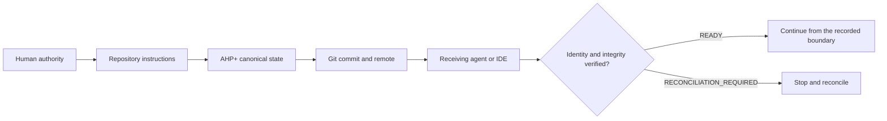

<div align="center">


# AHP+

**Verifiable project continuity across AI agents, IDEs, accounts, and machines.**

[](https://www.npmjs.com/package/@jossuealcala/ahp-plus)
[](https://github.com/jossuealcacao-exe/ahp_plus/actions/workflows/validate.yml)
[](package.json)
[](LICENSE)
[](https://github.com/jossuealcacao-exe/ahp_plus/releases/latest)

[English](README.md) · [Español](README.es.md) · [npm](https://www.npmjs.com/package/@jossuealcala/ahp-plus) · [Latest release](https://github.com/jossuealcacao-exe/ahp_plus/releases/latest) · [Portfolio](https://jossuealcala.com/en/)

</div>

---

AHP+ (**Agent Handoff Protocol Plus**) is an open, Git-backed protocol and a
reference CLI for preserving the operational truth of a software project:
state, decisions, evidence, checkpoints, authority boundaries, and verified
handoffs.

The model, chat, IDE, account, and machine may change. The repository remains
the source of truth.

## Why AHP+

AI tools are good at continuing a conversation, but a conversation is not a
durable project record. AHP+ answers the questions that matter when work moves
between environments:

- Which repository, branch, commit, and working tree are active?
- Which decisions are still valid, and who confirmed them?
- Which tests or external actions were actually observed?
- Is the current state local-only, waiting for a push, diverged, or portable?
- Can the next agent receive the handoff without silently changing scope?
- Does the agent have authority for the next external action?

## Install in a project

Requirements: Git, Node.js 20 or newer, and a Git repository with at least one
commit. The runtime has no third-party dependencies.

```bash
npm install --save-dev @jossuealcala/ahp-plus@latest
npx ahp init . --owner "Your name" --project your-project
```

Run the first heartbeat:

```bash
npx ahp root .
npx ahp doctor .
npx ahp verify . --strict
npx ahp status .
npx ahp context . --format markdown --budget 8000
```

Review the generated files before committing them. AHP+ never commits, pushes,
merges, deploys, publishes, deletes, or grants itself authority.

For an exact reproducible pin, install
`@jossuealcala/ahp-plus@1.1.0`. Do not use `main` as a production dependency.

## How it works



One AHP+ instance belongs to one Git repository. A parent workspace must never
lend its branch or commit identity to a nested repository.

## What AHP+ records

| Record | Purpose |
|---|---|
| Project state | Phase, objective, next action, blockers, and accepted Git boundary |
| Evidence | Reproducible commands, artifacts, URLs, checksums, and observed results |
| Decisions | Durable choices, authority, sources, and explicit supersession |
| QA | Pass/fail gates backed by evidence IDs |
| Checkpoints | Recoverable session boundaries |
| Handoffs | Sealed continuity between platforms with receiver verification |
| Risks and locks | Visible risk tracking and cooperative concurrency notices |

Claims use explicit certainty levels: `VERIFIED`, `USER_CONFIRMED`, `INFERRED`,
`UNVERIFIED`, `STALE`, and `CONFLICTED`.

## Terminal and IDE usage

AHP+ has one command contract. Adapters translate that contract into the
conventions of each host without changing protocol semantics.

| Surface | Installed interface | Example |
|---|---|---|
| Terminal | `npx ahp` | `npx ahp verify . --strict` |
| Cursor | `/ahp` command | `/ahp verify strict` |
| OpenCode | `/ahp` command | `/ahp handoff to claude` |
| Codex | Local `$ahp` skill | `Use $ahp to verify this repository` |
| Claude Code | Repository instructions | `Use AHP+ to run doctor and strict verification` |
| ChatGPT / mobile | Read-only capsule or CLI when available | `Read AHP_MOBILE.md and inspect HOF-...` |
| Generic agents | `AGENTS.md` + `AHP_INSTRUCTIONS.md` | `Follow this repository's AHP+ instructions` |

Preview adapter changes first, then apply them deliberately:

```bash
npx ahp adapter install all .
npx ahp adapter install all . --apply
```

See [commands by surface](docs/COMMANDS_BY_SURFACE_ES.md) for complete terminal,
IDE, and app examples.

## Handoff workflow

Create a recoverable boundary and transfer it to another host:

```bash
npx ahp checkpoint . \
  --session feature-auth \
  --platform codex \
  --actor "Codex" \
  --summary "Validated the authentication boundary" \
  --next-action "Continue with the refresh-token test"

npx ahp handoff create . \
  --from codex \
  --to cursor \
  --session feature-auth \
  --summary "Continue from the validated boundary"
```

At the receiving environment:

```bash
npx ahp verify . --strict
npx ahp handoff inspect HOF-... .
npx ahp handoff receive HOF-... .
npx ahp sync check . --require-remote
```

`READY` proves compatibility with the recorded boundary. It does not authorize
a commit, push, merge, deployment, publication, payment, deletion, or access to
secrets.

## Portability states

| Status | Operational meaning |
|---|---|
| `LOCAL_ONLY` | Project changes are not transported by Git |
| `PUSH_REQUIRED` | New AHP+ state still needs an authorized commit and push |
| `REMOTE_DIVERGED` | Local and remote history require reconciliation |
| `REMOTE_READY` | The clean checkout matches its configured upstream |

## Where AHP+ fits

AHP+ complements existing agent infrastructure:

- **AGENTS.md** defines how agents should work in a repository.
- **MCP** connects AI applications to tools, data, and prompts.
- **A2A** supports live communication between independent agents.
- **ACP** connects agents to editors and interactive clients.
- **Git** transports and audits confirmed content.
- **AHP+** preserves durable project state, evidence, authority, portability,
  and receiver-verified handoffs across all of them.

Read [What makes AHP+ different](docs/WHY_AHP_ES.md) for the detailed boundary.

## Verified release quality

AHP+ 1.1.0 is tested on Ubuntu, macOS, and Windows with Node.js 20 and 22. The
stable release passed:

- core tests and protocol conformance;
- strict integrity and ancestry verification;
- shallow-clone and native Windows Git-path checks;
- package-content and checksum verification;
- clean installation from npm `latest`;
- adapter installation across all supported surfaces;
- a real Codex-to-Cursor consumer handoff in `iris-foundation`.

The npm and GitHub release artifacts share SHA-256
`c953fe7eb0c67070bf91d6342d1d1efe5fc036045eb5b3edf6897efa5cfc0548`.

## Documentation

| Guide | Purpose |
|---|---|
| [Getting started](docs/GETTING_STARTED_ES.md) | Installation and first 15 minutes |
| [Daily operations](docs/OPERATIONS_ES.md) | State, evidence, checkpoints, handoffs, and updates |
| [Commands](docs/COMMANDS.md) | Normative CLI command contract |
| [Commands by surface](docs/COMMANDS_BY_SURFACE_ES.md) | Terminal, IDE, and app invocation |
| [Architecture](docs/ARCHITECTURE.md) | Repository identity and protocol layout |
| [Conformance](docs/CONFORMANCE.md) | Cross-platform acceptance criteria |
| [Distribution channels](docs/CHANNELS_ES.md) | Stable `latest` and development `next` |
| [Community feedback](docs/COMMUNITY_FEEDBACK_ES.md) | Safe, reproducible issue reports |
| [Specification](SPECIFICATION.md) | Normative AHP+ 1.1 protocol |

## Distribution channels

- **Stable:** semantic versions on npm `latest` and non-prerelease GitHub
  Releases.
- **Development:** prerelease versions such as `1.1.1-dev.0` on npm `next` and
  GitHub prereleases.

## Security and contributing

Do not publish secrets, private repository content, customer data, or complete
`.ahp/` directories in public issues. Follow [SECURITY.md](SECURITY.md) for
security reports and [CONTRIBUTING.md](CONTRIBUTING.md) for changes.

## Author

Created and maintained by **Jossue Alcalá**.

- [Portfolio](https://jossuealcala.com/en/)
- [GitHub](https://github.com/jossuealcacao-exe)
- [LinkedIn](https://www.linkedin.com/in/jossue-alcala)

## License

Apache-2.0. See [LICENSE](LICENSE) and [NOTICE](NOTICE).
